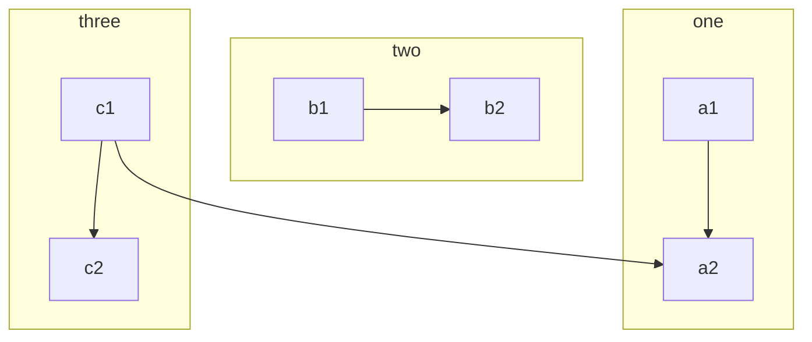
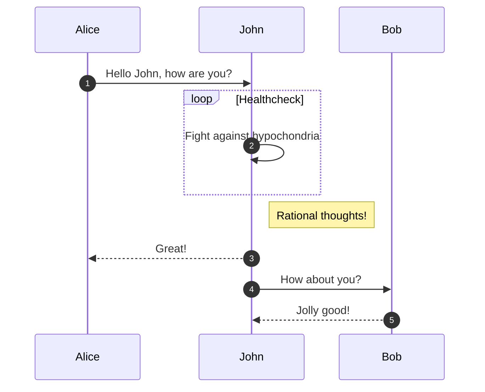
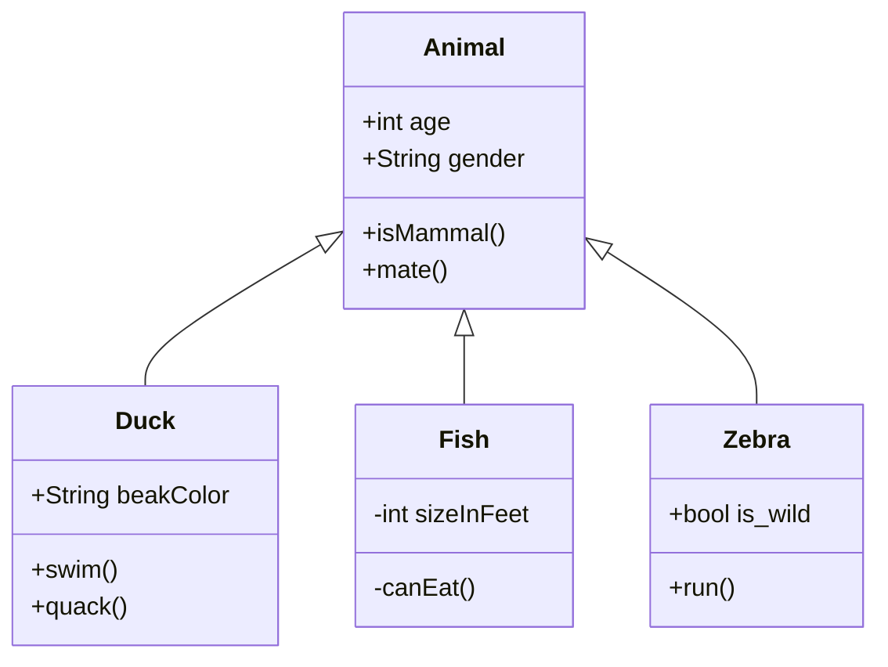
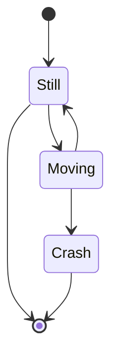
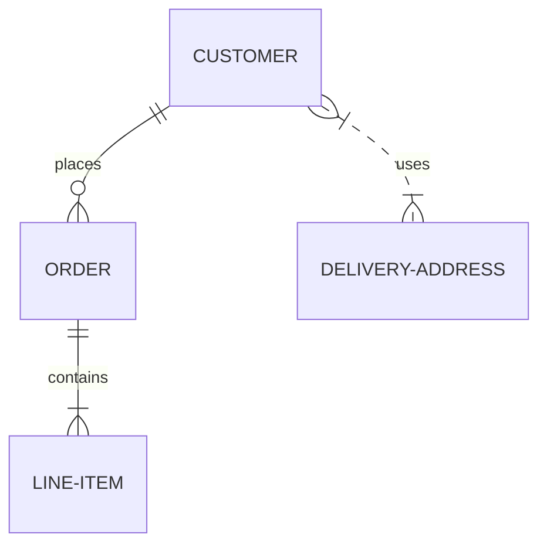
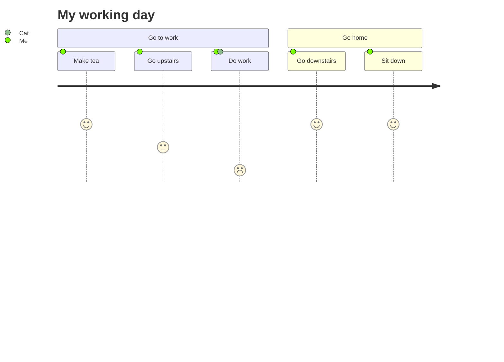
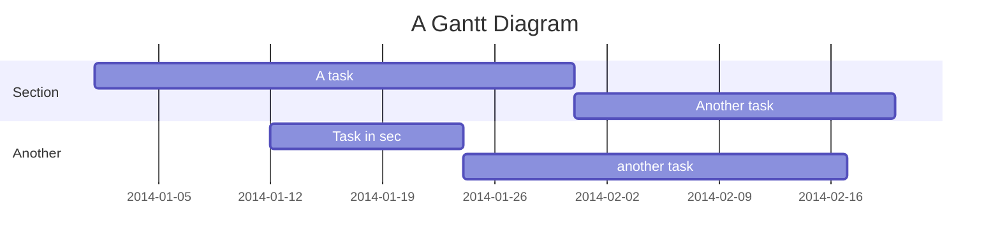
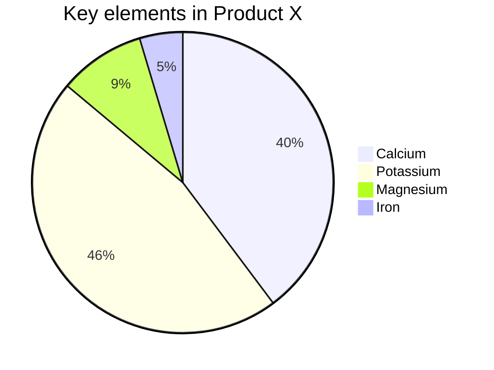
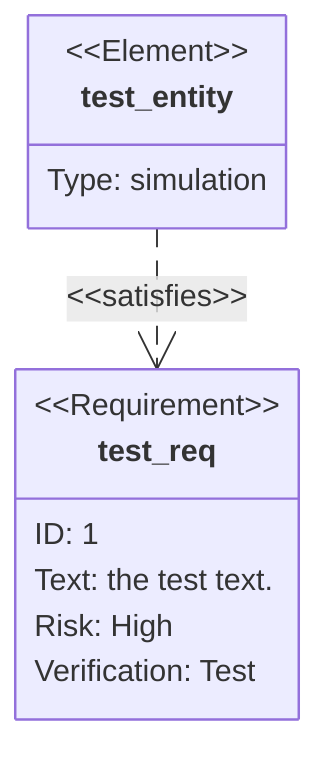

## Vditor 拓展语法

此章节为 Vditor 基于通用 Markdown 语法的拓展实现, 并非通用语法, 因此极多的渲染器和编辑器仅实现了其中的**一部分**语法特性, Vditor 同样不支持部分特性。

Vdok 基于 Vditor **深度定制**开发, **渲染结果与 Vditor 并不完全一致**, 仅为兼容 Vditor 的实现 (后期可能会有并不兼容之处。如果您发现了冲突之处或者希望支持的部分, 请通过 [GitHub Issues](https://github.com/HerbertHe/vdok/issues) 进行反馈)。

## 标题自定义锚点

> Vditor 的 `v3.8.5` 并没有暴露设置自定义锚点给自定义渲染器实现, 因此下面的实现为 hack 的自定义实现, 请使用下面的标准语法, 否则可能会导致某些错误产生。

```markdown
# 标题 {\#自定义锚点}

# 标题 {\#heading}

\ 为转义符号, 写文档时请忽略。
```

## 公式

公式渲染通过 [$\KaTeX$](https://katex.org/) 实现。

### 行内公式

```markdown
质能方程: $E = mc^2$, 薛定谔方程: $\hat H \Psi=i \hbar \frac{\partial}{\partial t}\Psi$
```

输出:

质能方程: $E = mc^2$, 薛定谔方程: $\hat H \Psi=i \hbar \frac{\partial}{\partial t}\Psi$

### 公式块

```markdown
$$
\nabla \times H = J + \frac{\partial D}{\partial t} \newline
\nabla \times E = - \frac{\partial B}{\partial t} \newline
\nabla \cdot B = 0 \newline
\nabla \cdot D = \rho
$$
```

输出:

$$
\nabla \times H = J + \frac{\partial D}{\partial t} \newline
\nabla \times E = - \frac{\partial B}{\partial t} \newline
\nabla \cdot B = 0 \newline
\nabla \cdot D = \rho
$$

## 脑图 Mindmap

````markdown
```mindmap
- Vdok
  - Author
    - Herbert He
  - Technology stack
    - Vditor
    - Vite
    - React
    - Windi CSS
```
````

输出:

```mindmap
- Vdok
  - Author
    - Herbert He
  - Technology stack
    - Vditor
    - Vite
    - React
    - Windi CSS
```

## Echarts

## Mermaid

下面的图形通过 [Mermaid](https://mermaid-js.github.io/mermaid/#/) 实现, 所有的示例均来自于 Mermaid 示例。

> 更多 Mermaid 语法, 请参考 [Mermaid](https://mermaid-js.github.io/mermaid/#/) 文档。

### 流程图

````markdown

````


### 时序图

````markdown

````


### 类图

````markdown

````


### 状态图

````markdown

````


### ER 模型

````markdown

````


### 用户旅途

````markdown

````


### 甘特图

````markdown

````


### 饼图

````markdown

````


### 需求图

> 测试中！

````markdown

````

## Graphviz

## Plantuml UML图

## 五线谱
